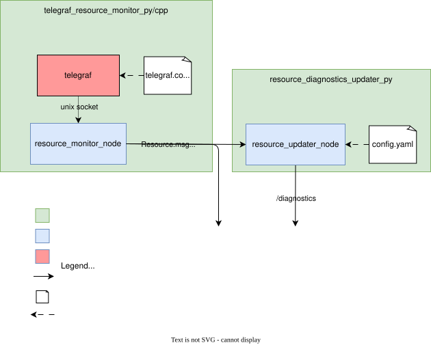

<p align="center">
   
</p>

# Telegraf Resource Monitor

This repository provides a ROS 2-based resource monitoring solution that leverages
[Telegraf](https://www.influxdata.com/time-series-platform/telegraf/) to collect system metrics and
publish them as ROS messages, with the possibility of also plugging into ROS2 diagnostics. It is
designed to be easily configurable and extensible, allowing users to monitor various system
resources such as CPU, memory, disk usage, and more. There are two implementations, one in Python
and one in CPP.

## Documentation

The motivation, architecture and more can be found on the accompanying pages:
<https://bart-van-ingen.github.io/telegraf_resource_monitor/>

## Table of Contents

- [Installation](#installation)
  - [Prerequisites](#prerequisites)
  - [Installing the Package](#installing-the-package)
- [telegraf_resource_monitor_py/cpp usage](#telegraf_resource_monitor_pycpp-usage)
  - [Basic Launch](#basic-launch)
  - [Launch with Custom Parameters and Logging Level](#launch-with-custom-parameters-and-logging-level)
  - [Configuration](#configuration)
- [resource_diagnostics_updater_py/cpp usage](#resource_diagnostics_updater_pycpp-usage)
  - [Basic Launch](#basic-launch-1)
  - [Launch with Custom Parameters and Logging Level](#launch-with-custom-parameters-and-logging-level-1)
  - [Configuration](#configuration-1)
- [Documentation](#the-documentation)

## Installation

### Prerequisites

- ROS 2 Humble
- (OPTIONAL) lm-sensors, for temperature monitoring

### Installing the Package

1. **Clone the repository** into your ROS 2 workspace:

   ```bash
   cd ~/ros2_ws/src
   git clone https://github.com/Bart-van-Ingen/telegraf_resource_monitor.git
   ```

1. **Install dependencies**:

   ```bash
   cd ~/ros2_ws
   rosdep install --from-paths src --ignore-src -r -y
   ```

1. **Build the package**:

   ```bash
   colcon build
   ```

1. **Source the workspace**:
   ```bash
   source install/setup.bash
   ```

## Overview

The architecture of these package is summarized in the following diagram and further explained in
the accompanying documentation
[architecture](http://127.0.0.1:8002/telegraf_resource_monitor/architecture/) page.

<p align="center">
   
</p>

## telegraf_resource_monitor_py/cpp usage

Starts and interfaces with telegraf over a unix socket and publishes the resources over ROS2
topics.

### Basic Launch

Run the following command to launch the Telegraf resource monitor with default settings:

<details>
<summary><b>Python version</b></summary>

```bash
ros2 launch telegraf_resource_monitor_py telegraf_resource_monitor_launch.py
```

</details>

<details>
<summary><b>C++ version</b></summary>

```bash
ros2 launch telegraf_resource_monitor_cpp telegraf_resource_monitor_launch.py
```

</details>

### Launch with Custom Parameters and Logging Level

the following command allows you to specify a custom ROS2 configuration file and set the logging
level:

<details>
<summary><b>Python version</b></summary>

```bash
ros2 launch telegraf_resource_monitor_py telegraf_resource_monitor_launch.py \
    config_file_path:=/path/to/your/config.yaml \
    log_level:=DEBUG
```

</details>

<details>
<summary><b>C++ version</b></summary>

```bash
ros2 launch telegraf_resource_monitor_cpp telegraf_resource_monitor_launch.py \
    config_file_path:=/path/to/your/config.yaml \
    log_level:=DEBUG
```

</details>

### Configuration

There is a pre-configured Telegraf configuration file at
`src/telegraf_resource_monitor_py/config/telegraf.conf` that:

- Collects metrics every 100 millisecond (configurable per input)
- Outputs data to Unix socket `/tmp/telegraf.sock`
- Includes processors for data cleanup and tagging
- Monitors CPU, memory, disk, sensors, and ROS processes

This single file is shared by both implementations. It is installed into the share directory of
`telegraf_resource_monitor_py`, and both launch files look it up there. The C++ package ships no
config of its own. To point Telegraf at a different file, pass `telegraf_config_path` to either
launch file:

```bash
ros2 launch telegraf_resource_monitor_py telegraf_resource_monitor_launch.py \
    telegraf_config_path:=/path/to/your/telegraf.conf
```

Note that colcon copies the config into the install space, so edits to the source file only take
effect after a rebuild. Build with `colcon build --symlink-install` if you want to edit it in
place.

Look at the [influx plugins](https://docs.influxdata.com/telegraf/v1/plugins/) to find other
plugins that can monitor relevant resources for you.

## resource_diagnostics_updater_py/cpp usage

There are two implementations, one in Python (`resource_diagnostics_updater_py`) and one in C++
(`resource_diagnostics_updater_cpp`). Both run a `resource_diagnostics_updater_node`, read the same
`diagnosed_resources` config format, and publish aggregated diagnostics to `/diagnostics`.

Subscribes to predetermined resource topics and emits diagnostic messages accordingly.

### Basic Launch

<details>
<summary><b>Python version</b></summary>

Run the following command in terminal to launch the diagnostics resource updater with the default configuration file:

```bash
ros2 launch resource_diagnostics_updater_py resource_diagnostics_updater_launch.py
```

The default config path is relative (`src/resource_diagnostics_updater_py/config/resource_diagnostics.yaml`), so run this from the workspace root or pass an absolute path with `config_file_path`.

</details>

<details>
<summary><b>C++ version</b></summary>

The C++ package ships no standalone launch file. Run the node directly with a params file:

```bash
ros2 run resource_diagnostics_updater_cpp resource_diagnostics_updater_node \
    --ros-args --params-file src/resource_diagnostics_updater_py/config/resource_diagnostics.yaml
```

To run it in one process together with the C++ Telegraf monitor, use the composed launch file
(see [Composable Nodes](docs/learnings/composable_nodes.md)):

```bash
ros2 launch telegraf_resource_monitor_bringup resource_monitor_composed_launch.py \
    config_file_path:=/path/to/resource_diagnostics.yaml
```

</details>

### Launch with Custom Parameters and Logging Level

<details>
<summary><b>Python version</b></summary>

You can specify a custom configuration file and set the logging level using the following command:

```bash
ros2 launch resource_diagnostics_updater_py resource_diagnostics_updater_launch.py \
config_file_path:=custom_path/resource_diagnostics.yaml \
log_level:=DEBUG
```

</details>

<details>
<summary><b>C++ version</b></summary>

```bash
ros2 run resource_diagnostics_updater_cpp resource_diagnostics_updater_node \
    --ros-args --params-file custom_path/resource_diagnostics.yaml \
    --log-level resource_diagnostics_updater_node:=DEBUG
```

</details>

### Configuration

There is a sample configuration file at `src/resource_diagnostics_updater_py/config/resource_diagnostics.yaml` that specifies which resources to monitor and their corresponding diagnostic parameters. Both implementations use this same file and format. You can modify this file to suit your monitoring needs or create your own that you then specify during launch.

The configuration file uses the following format:

```yaml
/resource_diagnostics_updater_node:
  ros__parameters:
    diagnosed_resources: |
      - topic: <topic name of resource to monitor>
        name: <name to show in diagnostics>
        field: <field to monitor>
        warning_threshold: <value for warning threshold> 
        error_threshold: <value for error threshold>
```

## The documentation

The more detailed documentation is deployed using mkdocs. To run it on your local device, run the
following terminal command:

```bash
uv run --directory src --group docs mkdocs serve -a 127.0.0.1:8001
```
