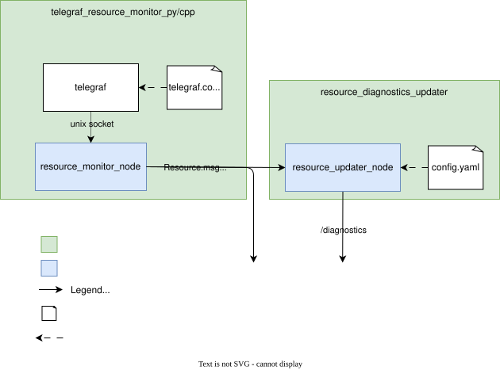

<p align="center">
   
</p>

# Telegraf Resource Monitor

This repository provides a ROS 2-based resource monitoring solution that leverages [Telegraf](https://www.influxdata.com/time-series-platform/telegraf/) to collect system metrics and publish them as ROS messages, with the possibility of also plugging into ROS2 diagnostics. It is designed to be easily configurable and extensible, allowing users to monitor various system resources such as CPU, memory, disk usage, and more. There are two implementations, one in Python and one in CPP.

## Table of Contents

- [Motivation](#motivation)
- [Installation](#installation)
  - [Prerequisites](#prerequisites)
  - [Installing Telegraf](#installing-telegraf)
  - [Installing the Package](#installing-the-package)
- [Architecture](#architecture)
  - [telegraf_resource_monitor_py/cpp](#telegraf_resource_monitor_pycpp)
  - [resource_diagnostics_updater](#resource_diagnostics_updater)
  - [resource_monitoring_interfaces](#resource_monitoring_interfaces)
- [Maintainer](#maintainer)
- [Acknowledgments](#acknowledgments)

## Motivation

Monitoring system resources is important for maintaining the health and determining performance of robotic systems. There does not seem to be a well established solution to do this in ROS 2, with these the current ones that can be found easily online:

- https://github.com/AgoraRobotics/ros2-system-monitor
- https://github.com/kei1107/ros2-system-monitor
- https://github.com/ethz-asl/ros-system-monitor
- https://tier4.github.io/autoware.iv/tree/main/system/system_monitor/

This project attempts to fill that gap.

### Telegraf as backbone

Resource monitoring is not a unique problem to robotics, and there are many existing tools that do this well. A well established tool within the cloud native and DevOps communities is Telegraf.
[Telegraf](https://www.influxdata.com/time-series-platform/telegraf/) is an open-source agent for collecting and reporting metrics. It supports a variety of input plugins to gather data from different sources and output plugins to send data to various destinations. By integrating Telegraf with ROS 2, we do not have to reinvent the wheel of resource monitoring and can leverage its more advanced capabilities, such as aggregators and processors.

Telegraf also present the opportunity to build out remote monitoring capabilities of the same resources over the OTLP protocol, which is a common standard for telemetry data. This can be connect to any [opentelemetry collector](https://opentelemetry.io/docs/collector/distributions/) which can then pass it on to whatever remote monitoring environment you wish.

## Installation

### Prerequisites

- ROS 2 Humble
- (OPTIONAL) lm-sensors, for temperature monitoring

### Installing Telegraf

Telegraf can be fetched
automatically into the workspace by the `telegraf_vendor` package (recommended), or be installed system-wide (apt or binary, below).

#### Through the vendor package (recommended)

Nothing to do here: `telegraf_vendor` downloads telegraf during `colcon build`
and installs it into the workspace, so no system-wide install is needed. If
telegraf is already on your system, it is reused instead of downloaded. See
[docs/vendor_packages.md](docs/vendor_packages.md) for what a vendor package is
and how this one works. Skip straight to [Installing the Package](#installing-the-package).


<details>
<summary><b>Through apt</b></summary>

As per https://www.influxdata.com/get-telegraf/

```bash
# Add InfluxDB repository
# influxdata-archive.key GPG fingerprint:
#   Primary key fingerprint: 24C9 75CB A61A 024E E1B6  3178 7C3D 5715 9FC2 F927
#   Subkey fingerprint:      9D53 9D90 D332 8DC7 D6C8  D3B9 D8FF 8E1F 7DF8 B07E
wget -q https://repos.influxdata.com/influxdata-archive.key
gpg --show-keys --with-fingerprint --with-colons ./influxdata-archive.key 2>&1 | grep -q '^fpr:\+24C975CBA61A024EE1B631787C3D57159FC2F927:$' && cat influxdata-archive.key | gpg --dearmor | sudo tee /etc/apt/trusted.gpg.d/influxdata-archive.gpg > /dev/null
echo 'deb [signed-by=/etc/apt/trusted.gpg.d/influxdata-archive.gpg] https://repos.influxdata.com/debian stable main' | sudo tee /etc/apt/sources.list.d/influxdata.list

sudo apt-get update && sudo apt-get install telegraf
```
</details>

<details>
<summary><b>As linux binary</b></summary>


find the specific version number from the [telegraf release page](https://github.com/influxdata/telegraf/releases) in the format x.xx.x.

Then fill this value accordingly with the following commands in terminal

```bash
wget https://dl.influxdata.com/telegraf/releases/telegraf-x.xx.x_linux_amd64.tar.gz \
    && tar -xzf telegraf-x.xx.x_linux_amd64.tar.gz \
    && rm telegraf-x.xx.x_linux_amd64.tar.gz \
    && mv telegraf-x.xx.x/usr/bin/telegraf /usr/local/bin/telegraf \
    && chmod +x /usr/local/bin/telegraf
```
</details>

### Installing the Package

1. **Clone the repository** into your ROS 2 workspace:

   ```bash
   cd ~/ros2_ws/src
   git clone https://github.com/Bart-van-Ingen/telegraf_resource_monitor.git
   ```

1. **Install dependencies**:

   ```bash
   cd ~/ros2_ws
   rosdep install --from-paths src --ignore-src -r -y
   ```

1. **Build the package**:

   ```bash
   colcon build
   ```

1. **Source the workspace**:
   ```bash
   source install/setup.bash
   ```

## Architecture

This repository contains four ROS 2 packages:

- `telegraf_resource_monitor_py` and `telegraf_resource_monitor_cpp`  
  Both Python and CPP implementation integrates Telegraf with ROS 2 to monitor system resources and publish them as ROS messages. Their architecture is the same, but there are some differences in the details, which are called out below.
- `resource_diagnostics_updater`  
  Subscribes to resource topics and updates the ROS 2 diagnostics system with the latest metrics, based on target resources stipulated in a configuration file.
- `resource_monitoring_interfaces`  
  Custom message definitions for resource monitoring.

The architecture between the packages is illustrated below:

<p align="center">
   
</p>

### telegraf_resource_monitor_py/cpp

The package consists of:

- **Telegraf Configuration**: Custom Telegraf config that outputs metrics to a Unix socket
- **Unix Socket Manager**: Receives JSON data from Telegraf via Unix socket
- **Sensor Message Processor**: Processes incoming sensor data and manages publishers
- **Sensor Message Publisher**: Publishes resource data as ROS 2 messages

#### Data Flow and Buffering

```
Telegraf --> Unix socket --> read thread --> queue --> processor thread --> ROS publishers
             (kernel buffer)                          (publish)
```

The read thread splits the incoming byte stream into lines and puts them on a queue inside
the node. The processor thread takes them off the queue and publishes them, so the socket is
drained quickly no matter how slow publishing is.

The two implementations split the work slightly differently:

- **C++**: the read thread uses `getline` and pushes the raw string onto the queue. JSON
  parsing happens on the processor thread, in `SensorMessageBuffer::get_message`.
- **Python**: the read thread uses `recv` and splits on newlines itself. JSON parsing happens
  on that same read thread, in `SensorMessageBuffer.add_message`, so the queue holds parsed
  `SensorMessage` objects rather than strings.

Note that there are two buffers. The kernel already buffers the Unix socket and blocks Telegraf's `write()` when full rather than dropping
data. The queue absorbs bursts: Telegraf
writes on its `flush_interval`, not its `interval`, so an `interval` of `100ms` with a
`flush_interval` of `1s` would deliver a whole second of lines at once. Since
`telegraf.conf` belongs to whoever installs the package, the queue keeps the node
tolerant of rates it was not tuned for. It does not help with sustained overload,
where the input rate simply exceeds what the node can publish.

The queues also behave differently under overload:

- **C++**: the queue is bounded by the `max_buffer_size` parameter (default 100). When it is
  full, the oldest message is dropped and a warning is logged.
- **Python**: the queue is unbounded, so it grows instead of dropping.

#### Topics Published

The package dynamically creates topics based on the metrics collected by Telegraf. This is set by the config in src/telegraf_resource_monitor_py/config/telegraf.conf.

**Examples** include:

- `/cpu/cpu0`
- `/cpu/cpu1`
- `/cpu/cpu2`
- `/cpu/cpu3`
- `/cpu/cpu_total`
- `/disk/root`
- `/mem`
- `/procstat/telegraf_resource_monitor_node`
- `/sensors/acpitz_acpi_0/temp1`
- `/sensors/amdgpu_pci_0400/edge`
- `/sensors/amdgpu_pci_0400/slowppt`
- `/sensors/amdgpu_pci_0400/vddgfx`
- `/sensors/amdgpu_pci_0400/vddnb`
- `/sensors/bat1_acpi_0/in0`
- `/sensors/iwlwifi_1_virtual_0/temp1`
- `/sensors/k10temp_pci_00c3/tctl`
- `/sensors/nvme_pci_0100/composite`
- `/sensors/nvme_pci_0100/sensor_1`

Each topic publishes `Resource` messages from the [resource_monitoring_interfaces](#resource_monitoring_interfaces) package.

#### Usage

##### Basic Launch

Run the following command to launch the Telegraf resource monitor with default settings:

<details>
<summary><b>Python</b></summary>

```bash
ros2 launch telegraf_resource_monitor_py telegraf_resource_monitor_launch.py
```

</details>

<details>
<summary><b>C++</b></summary>

```bash
ros2 launch telegraf_resource_monitor_cpp telegraf_resource_monitor_launch.py
```

</details>

##### Launch with Custom Parameters and Logging Level

the following command allows you to specify a custom ROS2 configuration file and set the logging level:

<details>
<summary><b>Python</b></summary>

```bash
ros2 launch telegraf_resource_monitor_py telegraf_resource_monitor_launch.py \
    config_file_path:=/path/to/your/config.yaml \
    log_level:=DEBUG
```

</details>

<details>
<summary><b>C++</b></summary>

```bash
ros2 launch telegraf_resource_monitor_cpp telegraf_resource_monitor_launch.py \
    config_file_path:=/path/to/your/config.yaml \
    log_level:=DEBUG
```

</details>

##### Configuration

There is a pre-configured Telegraf configuration file at `src/telegraf_resource_monitor_py/config/telegraf.conf` that:

- Collects metrics every 100 millisecond (configurable per input)
- Outputs data to Unix socket `/tmp/telegraf.sock`
- Includes processors for data cleanup and tagging
- Monitors CPU, memory, disk, sensors, and ROS processes

This single file is shared by both implementations. It is installed into the share directory of
`telegraf_resource_monitor_py`, and both launch files look it up there. The C++ package ships no
config of its own. To point Telegraf at a different file, pass `telegraf_config_path` to either
launch file:

```bash
ros2 launch telegraf_resource_monitor_py telegraf_resource_monitor_launch.py \
    telegraf_config_path:=/path/to/your/telegraf.conf
```

Note that colcon copies the config into the install space, so edits to the source file only take
effect after a rebuild. Build with `colcon build --symlink-install` if you want to edit it in place.

Look at the [influx plugins](https://docs.influxdata.com/telegraf/v1/plugins/) to find other plugins that can monitor relevant resources for you.

No topic configuration is needed on the node side, since it will parse the available fields and use its names to generate the topics accordingly. The nodes do declare a few ROS parameters:

| Parameter | Default | Packages | Description |
| --- | --- | --- | --- |
| `socket_path` | `/tmp/telegraf.sock` | py and cpp | Path of the Unix socket the node creates and Telegraf writes to. Must match `outputs.socket_writer` in `telegraf.conf`. |
| `max_buffer_size` | `100` | cpp only | Maximum number of queued lines before the oldest is dropped. |

### resource_diagnostics_updater

The package consists of:

- **Diagnostics Resource Updater**: Subscribes to specific resource topics and updates the ROS 2 diagnostics system based on specified DiagnosedResource defined during initialization.
- **Diagnostics Resource Updater Node**: Parses a configuration file to determine which resources to monitor and initializes the Diagnostics Resource Updaters accordingly.
- **Diagnostics Publisher**: Publishes aggregated diagnostics information to the `/diagnostics` topic at 1 Hz and is an interface to the diagnostics topic for the updaters. An updater that goes to warning or error level publishes straight away instead of waiting for the next timer tick.

#### Configuration

There is a sample configuration file at `src/resource_diagnostics_updater/config/resource_diagnostics.yaml` that specifies which resources to monitor and their corresponding diagnostic parameters. You can modify this file to suit your monitoring needs or create your own that you then specify during launch.

The configuration file uses the following format:

```yaml
/resource_diagnostics_updater_node:
  ros__parameters:
    diagnosed_resources: |
      - topic: <topic name of resource to monitor>
        name: <name to show in diagnostics>
        field: <field to monitor>
        warning_threshold: <value for warning threshold> 
        error_threshold: <value for error threshold>
```

#### Usage

##### Basic Launch

Run the following command in terminal to launch the diagnostics resource updater with the default configuration file:

```bash
ros2 launch resource_diagnostics_updater resource_diagnostics_updater_launch.py
```

The default config path is relative (`src/resource_diagnostics_updater/config/resource_diagnostics.yaml`), so run this from the workspace root or pass an absolute path with `config_file_path`.

##### Launch with Custom Parameters and Logging Level

You can specify a custom configuration file and set the logging level using the following command:

```bash
ros2 launch resource_diagnostics_updater resource_diagnostics_updater_launch.py \
config_file_path:=custom_path/resource_diagnostics.yaml \
log_level:=DEBUG
```


### resource_monitoring_interfaces

Defines custom ROS 2 message types for messages sent by the [telegraf_resource_monitor_py/cpp](#telegraf_resource_monitor_pycpp) packages, including:

- `Field.msg`: Represents a single metric field with name and value
- `Resource.msg`: Represents a resource with a header and an array of `Field` messages

## Maintainer

**Bart van Ingen**  
Email: van.ingen.bart@gmail.com

## Acknowledgments

- Built on [Telegraf](https://www.influxdata.com/time-series-platform/telegraf/) by InfluxData
- Uses ROS 2 for distributed messaging
